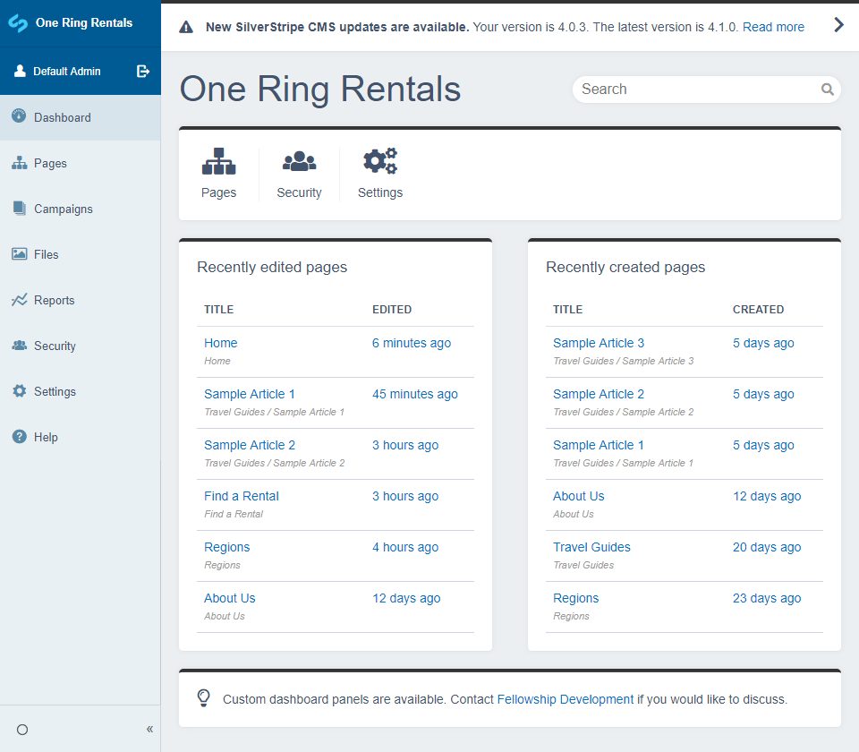

# Silverstripe Dashboard

This dashboard module provides a landing page for users logging into the CMS. Out of the box, allows viewing the state of recently created or modified pages, searching for pages & files as well as letting the user know whether the Silverstripe install is out of date.

## Requirements

* Silverstripe Framework 4.0+

## Documentation
* [Index](https://plastyk.github.io/silverstripe-dashboard/en/)
* [Installation](https://plastyk.github.io/silverstripe-dashboard/en/#installation-with-composer)
* [Configuration](https://plastyk.github.io/silverstripe-dashboard/en/#configuration)
* [Customisation](https://plastyk.github.io/silverstripe-dashboard/en/#customisation)

