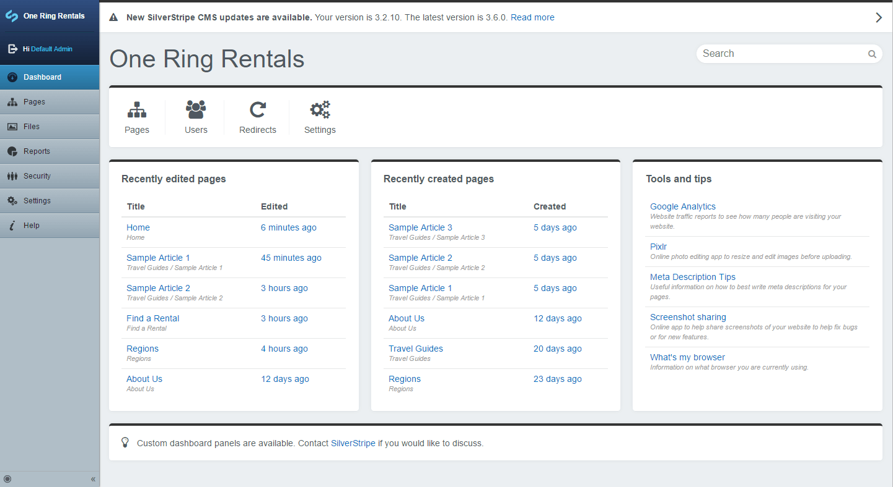

# An extendable SilverStripe Dashboard

This dashboard module provides a landing page for users logging into the CMS. Out of the box, allows viewing the state of recently created or modified pages, searching for pages & files as well as letting the user know whether the SilverStripe install is out of date.

## Default panels
* Quicklinks
* Recently edited pages
* Recently created pages
* Tools and tips
* Contact/more information
* SilverStripe version/update panel

## Default search panels
* File
* Page
* Member

## Documentation
* [Index](docs/en/index.md)
* [Installation](docs/en/index.md#installation-with-composer)
* [Configuration](docs/en/index.md#configuration)
