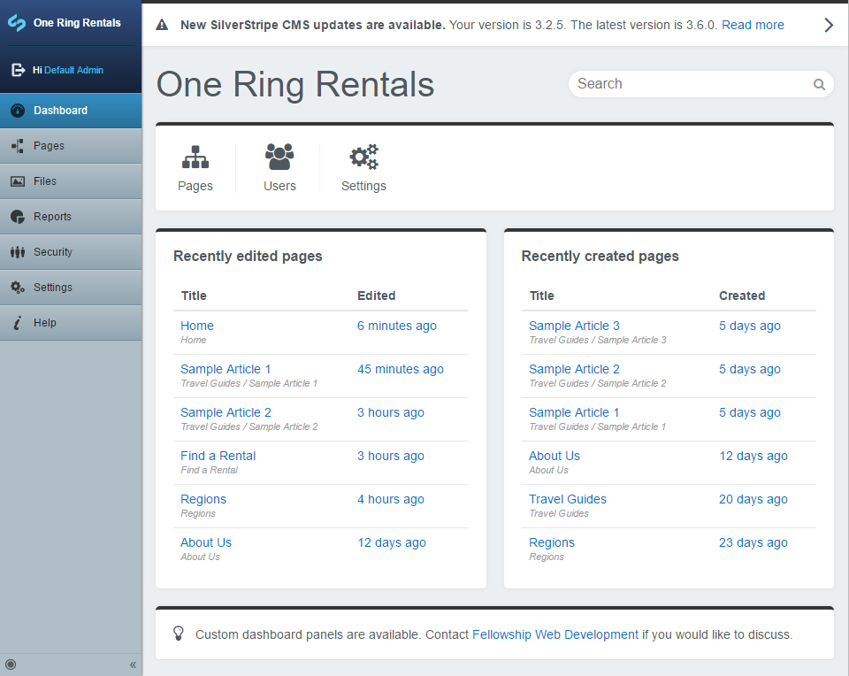

# An extendable SilverStripe Dashboard

This dashboard module provides a landing page for users logging into the CMS. Out of the box, allows viewing the state of recently created or modified pages, searching for pages & files as well as letting the user know whether the SilverStripe install is out of date.

## Documentation
* [Index](https://plastyk.github.io/silverstripe-dashboard/en/)
* [Installation](https://plastyk.github.io/silverstripe-dashboard/en/#installation-with-composer)
* [Configuration](https://plastyk.github.io/silverstripe-dashboard/en/#configuration)

## Default panels
* SilverStripe version/update panel
* Quick links
* Recently edited pages
* Recently created pages
* Tools and tips
* Contact/more information

## Default search panels
* File
* Page
* Member
