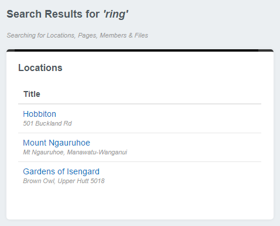

# Adding extra search panels

By default the dashboard will search for pages, members and files. We can add extra search panels to search for any other class.

In this example we will create a search panel that searches for `Property` items.

## Creating a new search panel

Say we have a custom `DataObject` named `Property`. We would like to search for properties through the dashboard.

First we create a `dashboard-custom` folder in our root directory to house our custom dashboard code. To enable the `dashboard-custom` directory to be picked up by SilverStripe we must create a `_config` directory inside `dashboard-custom`.

Next we create a new PHP file `DashboardSearchResultPropertyPanel.php` in `dashboard-custom/src/search/`. In our `dashboard-custom/src/search/DashboardSearchResultPropertyPanel.php` file we create a `DashboardSearchResultPropertyPanel` class, which extends `DashboardSearchResultPanel`:

```php
<?php
class DashboardSearchResultPropertyPanel extends DashboardSearchResultPanel
{
    protected $className = 'Property';
    protected $searchFields = array('Title', 'Address', 'Content');
    protected $sort = array('Title' => 'ASC');
    protected $exclusions = array('Title' => 'Mordor');

    public function canView($member = null)
    {
        return parent::canView($member) && Permission::check('CMS_ACCESS_PropertyAdmin') && class_exists('PropertyAdmin');
    }
}
```

In our `DashboardSearchResultPropertyPanel` class we declare a `canView` function and set the `$className`, `$searchFields`, `$sort` and `$exclusions` variables.

* `canView` checks if the current user is able to view this panel by checking if they have permission to view the `Property` data.
* `$className` sets the class to search for to `Property`.
* `$searchFields` sets the search function to search in the `Proprty`'s `Title`, `Address` and `Content` fields.
* `$sort` sets the results to sort by `Title`.
* `$exclusions` excludes properties with a `Title` of `Mordor`.

Next we create a template for our custom search panel. In `dashboard-custom/templates/search/` we create a `DashboardSearchResultPropertyPanel.ss` template with the following code:

```html
<% if $Results %>
<div class="dashboard-panel dashboard-search" data-panel-class="$PanelClassName">
    <h3><a href="admin/properties/">Properties</a></h3>
    <table class="table">
        <thead>
            <tr>
                <th>Title</th>
            </tr>
        </thead>
        <tbody>
            <% loop $Results %>
            <tr>
                <td class="link">
                    <a href="$SearchResultCMSLink">
                        $Title
                        <div class="note">$Address</div>
                    </a>
                </td>
            </tr>
            <% end_loop %>
        </tbody>
    </table>
    <% include DashboardSearchPagination Results=$Results %>
</div>
<% end_if %>
```

Next we create a `config.yml` in our `dashboard-custom/_config/` directory to add `DashboardSearchResultLocationPanel` to the `DashboardAdmin` list of `search_panels`. We also declare a `dashboard_admin_link` on the `Location` class and add the `DashboardSearchResultExtension` so we can make use of the `$SearchResultCMSLink` variable in our template.

```yml
---
Name: dashboard-custom
After: '#dashboard-search'
---
DashboardAdmin:
  search_panels:
    - DashboardSearchResultLocationPanel

Location:
  dashboard_admin_link: 'admin/locations/Location/EditForm/field/Location/item/$ID/edit'
  extensions:
    - DashboardSearchResultExtension
```

We then call `?flush=all` in the browser URL to have the new template and class picked up by SilverStripe.

We can now see the dashboard searches for locations:


