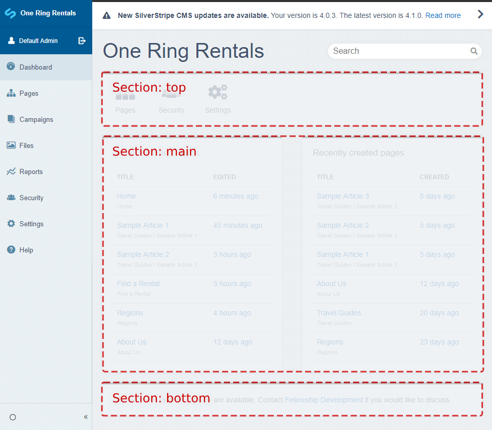

# Adding new panel sections

Panel sections are used to group panels together. The default panel sections are `top`, `main`, and `bottom`.



We can create custom panel sections if we have the need to have new separate groups of panels.

## Creating a new panel section

Say we have an online store and we would like to have a number of custom store related panels. We would like to create a panel section to group these store related panels together.

First we create a `dashboard-custom` folder in our root directory to house our custom dashboard code. To enable the `dashboard-custom` directory to be picked up by Silverstripe we must create a `_config` directory inside `dashboard-custom`.

Next we create a new PHP file `StoreDashboardPanelSection.php` in `dashboard-custom/src/PanelSections/`. In our `dashboard-custom/src/PanelSections/StoreDashboardPanelSection.php` file we create a `RecentlyEditedPropertiesPanel` class, which extends `DashboardPanel`:

```php
<?php

use Plastyk\Dashboard\Model\DashboardPanelSection;

class StoreDashboardPanelSection extends DashboardPanelSection
{
    private static $section = 'store';
    private static $sort = 5;
}
```

In our `StoreSection` class we have a `section` and a `sort` variable.

* `section` defines the section name that will be used to associate panels to this section.
* `sort` sets the sort order of the panel section. In this example we have set it to 5, which will be below the `top` section (sort order 0) and above the `main` section (sort order 50).

To add a panel to this section, we simply need to set the section variable in our custom panel classes.

For example, say we have the following custom dashboard panel classes:

```php
<?php

use Plastyk\Dashboard\Model\DashboardPanel;

class RecentOrdersPanel extends DashboardPanel
{
    private static $section = 'store';
}
```

```php
<?php

use Plastyk\Dashboard\Model\DashboardPanel;

class BestSellingProductsPanel extends DashboardPanel
{
    private static $section = 'store';
}
```

We then call `?flush=all` in the browser URL to have the new section added and the panels added to this section.