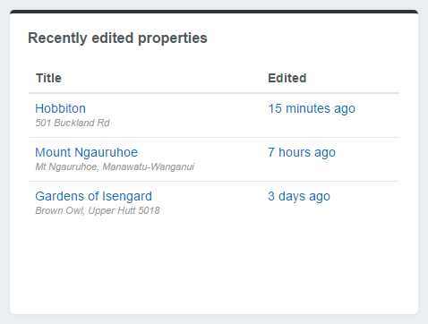

# Adding new panels

We can create custom panels to display anything that we like on our dashboard.

In this example we will create a panel that displays recently edited properties.

## Creating a new panel

Say we have a custom `DataObject` named `Property` that is controlled through a custom `ModelAdmin` called `PropertiesAdmin`. We would like to add a panel that lists recently edited properties.

First we create a `dashboard-custom` folder in our root directory to house our custom dashboard code. To enable the `dashboard-custom` directory to be picked up by SilverStripe we must create a `_config` directory inside `dashboard-custom`.

Next we create a new PHP file `RecentlyEditedPropertiesPanel.php` in `dashboard-custom/src/Panels/`. In our `dashboard-custom/src/Panels/RecentlyEditedPropertiesPanel.php` file we create a `RecentlyEditedPropertiesPanel` class, which extends `DashboardPanel`:

```php
<?php

use Plastyk\Dashboard\Model\DashboardPanel;
use SilverStripe\Security\Permission;

class RecentlyEditedPropertiesPanel extends DashboardPanel
{
    public function canView($member = null)
    {
        if (!Permission::checkMember($member, 'CMS_ACCESS_PropertiesAdmin') || !class_exists('Property')) {
            return false;
        }

        return parent::canView($member);
    }

    public function getData()
    {
        $data = parent::getData();

        $data['Results'] = $this->getResults();

        return $data;
    }

    public function getResults()
    {
        return Property::get()->filter(['LastEdited:GreaterThan' => date('c', strtotime('-6 months'))])->sort('LastEdited DESC')->limit(8);
    }
}
```

In our `RecentlyEditedPropertiesPanel` class we have a `canView`, a `getData` and a `Results` function.

* `canView` checks if the current user is able to view this panel by checking if they have permission to view the `Property` data.
* `getData` fetches the results for the template.
* `Results` returns a list of properties that have been edited in the last six months, limited to a maximum of eight results.

Next we create a template for our custom panel. In `dashboard-custom/templates/` we create a `RecentlyEditedPropertiesPanel.ss` template with the following code:

```html
<div class="dashboard-panel">
    <h3><a href="admin/properties/">Recently edited properties</a></h3>
    <% if $Results %>
    <table class="table">
        <thead>
            <tr>
                <th>Title</th>
                <th>Edited</th>
            </tr>
        </thead>
        <tbody>
            <% loop $Results %>
            <tr>
                <td class="link">
                    <a href="admin/properties/Property/EditForm/field/Property/item/{$ID}/edit">
                        $Title
                        <span class="note">$Address</span>
                    </a>
                </td>
                <td class="link date">
                    <a href="admin/properties/Property/EditForm/field/Property/item/{$ID}/edit">$LastEdited.Nice</a>
                </td>
            </tr>
            <% end_loop %>
        </tbody>
    </table>
    <% else %>
    <p>No properties edited in the last six months.</p>
    <% end_if %>
</div>
```

Next we create a custom `DashboardPanels.ss` template to add our new panel to the dashboard. Copy the original `DashboardPanels.ss` to `dashboard-custom/templates/DashboardPanels.ss` and add `$showPanel(RecentlyEditedPropertiesPanel)` to where we want the new panel to display:

```html
$showPanel(Plastyk\Dashboard\Panels\UpdatePanel)

<div class="container-fluid">
	<div class="row">
		<div class="col-12">
			$showPanel(Plastyk\Dashboard\Panels\SearchPanel)

			<h1>$SiteConfig.Title</h1>
		</div>
	</div>

	<div class="row">
		<div class="col-12">
			$showPanel(Plastyk\Dashboard\Panels\QuickLinksPanel)
		</div>
	</div>

	<% if $canViewPanel(RecentlyEditedPropertiesPanel) || $canViewPanel(Plastyk\Dashboard\Panels\RecentlyEditedPagesPanel) || $canViewPanel(Plastyk\Dashboard\Panels\UsefulLinksPanel) %>
	<div class="row">
		<div class="col-xl-4">
			$showPanel(RecentlyEditedPropertiesPanel)
		</div>
		<div class="col-xl-4">
			$showPanel(Plastyk\Dashboard\Panels\RecentlyEditedPagesPanel)
		</div>
		<div class="col-xl-4">
			$showPanel(Plastyk\Dashboard\Panels\UsefulLinksPanel)
		</div>
	</div>
	<% end_if %>

	<div class="row">
		<div class="col-12">
			$showPanel(Plastyk\Dashboard\Panels\MoreInformationPanel)
		</div>
	</div>
</div>
```

We then call `?flush=all` in the browser URL to have the new templates and class picked up by SilverStripe.

We can now see we have a recently edited properties panel on our dashboard:


