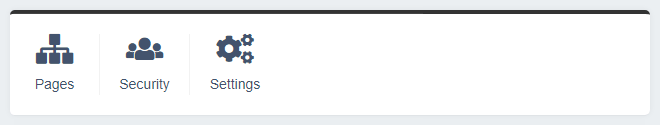
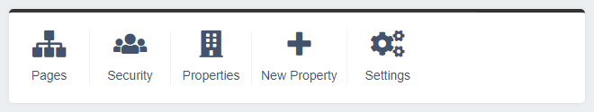

# Extending the QuickLinksPanel

By default the `QuickLinksPanel` displays links to the CMS pages, users and settings sections.



We can add, remove or modify these links by extending the `QuickLinksPanel`.

## Adding buttons to the QuickLinksPanel template

Say we have a custom `DataObject` named `Property` that is controlled through a custom `ModelAdmin` called `PropertiesAdmin`. We would like to add a quick link that links to the `PropertiesAdmin` as well a quick link to add a new `Property`.

First we create a `dashboard-custom` folder in our root directory to house our dashboard customisation code. Next we create a copy of the `QuickLinksPanel.ss` template and place this in `dashboard-custom/templates/Plastyk/Dashboard/Panels/`.

In our `dashboard-custom/templates/Plastyk/Dashboard/Panels/QuickLinksPanel.ss` template we add the new links we want:

```html
<div class="dashboard-panel quick-links-panel">

    <% if $CanViewPages %>
    <a href="admin/pages/">
        <span class="dashboard-icon fa fa-sitemap" aria-hidden="true"></span>
        <% _t('CMSPagesController.MENUTITLE','Pages') %>
    </a>
    <% end_if %>

    <% if $CanViewUsers %>
    <a href="admin/security/">
        <span class="dashboard-icon fa fa-users" aria-hidden="true"></span>
        <% _t('SecurityAdmin.MENUTITLE','Security') %>
    </a>
    <% end_if %>

    <a href="admin/properties/">
        <span class="dashboard-icon fa fa-building" aria-hidden="true"></span>
        Properties
    </a>

    <a href="admin/properties/Property/EditForm/field/Property/item/new">
        <span class="dashboard-icon fa fa-plus" aria-hidden="true"></span>
        New Property
    </a>

    <% if $CanViewSettings %>
    <a href="admin/settings/">
        <span class="dashboard-icon fa fa-cogs" aria-hidden="true"></span>
        <% _t('CMSSettingsController.MENUTITLE','Settings') %>
    </a>
    <% end_if %>

</div>
```

To enable the `dashboard-custom` directory to be picked up by SilverStripe we must create a `_config` directory inside `dashboard-custom`. We then call `?flush=all` in the browser URL to have the new template picked up by SilverStripe.

We can now see we have a link to the properties admin and a link to create a new property:



## Adding permission checks

We can improve on this code to check if the user has permission to view the properties section before displaying the buttons to the user.

First we create a `QuickLinksPanelExtension.php` extension class in `dashboard-custom/src/Extensions/`.

In our `dashboard-custom/src/Extensions/QuickLinksPanelExtension.php` class we call the `QuickLinksPanel` `updateData` hook to add in our permission check:

```php
<?php

use SilverStripe\Core\Extension;
use SilverStripe\Security\Permission;
use SilverStripe\Security\Security;

class QuickLinksPanelExtension extends Extension
{
    public function updateData(&$data)
    {
        $member = Security::getCurrentUser();

        $data['CanViewProperties'] = Permission::checkMember($member, 'CMS_ACCESS_PropertiesAdmin') && class_exists('PropertiesAdmin');
        $data['CanView'] = $data['CanView'] || $data['CanViewProperties'];
    }
}
```

We enable our extension by adding the following to our `dashboard-custom/_config/config.yml`:

```yml
---
Name: dashboard-custom
After: '#dashboard'
---
Plastyk\Dashboard\Panels\QuickLinksPanel:
  extensions:
    - QuickLinksPanelExtension
```

Then in our template we wrap our property buttons in a `$CanViewProperties` check:

```html
<div class="dashboard-panel quick-links-panel">

    <% if $CanViewPages %>
    <a href="admin/pages/">
        <span class="dashboard-icon fa fa-sitemap" aria-hidden="true"></span>
        <% _t('CMSPagesController.MENUTITLE','Pages') %>
    </a>
    <% end_if %>

    <% if $CanViewUsers %>
    <a href="admin/security/">
        <span class="dashboard-icon fa fa-users" aria-hidden="true"></span>
        <% _t('SecurityAdmin.MENUTITLE','Security') %>
    </a>
    <% end_if %>

    <% if $CanViewProperties %>
    <a href="admin/properties/">
        <span class="dashboard-icon fa fa-building" aria-hidden="true"></span>
        Properties
    </a>

    <a href="admin/properties/Property/EditForm/field/Property/item/new">
        <span class="dashboard-icon fa fa-plus" aria-hidden="true"></span>
        New Property
    </a>
    <% end_if %>

    <% if $CanViewSettings %>
    <a href="admin/settings/">
        <span class="dashboard-icon fa fa-cogs" aria-hidden="true"></span>
        <% _t('CMSSettingsController.MENUTITLE','Settings') %>
    </a>
    <% end_if %>

</div>
```

Now our buttons will only display to users who can view those sections.

## Customising icons

When adding new buttons we can make use of the range of [Font Awesome icons](https://fontawesome.com/icons) that are included with the dashboard module.
