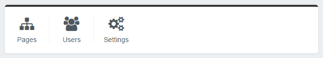
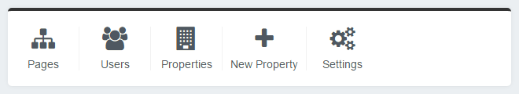

# Extending the QuickLinksPanel

By default the `QuickLinksPanel` displays links to the CMS pages, users and settings sections.



We can add, remove or modify these links.

## Adding buttons to the QuickLinksPanel template

Say we have a custom `DataObject` named `Property` that is controlled through a custom `ModelAdmin` called `PropertiesAdmin`. We would like to add a quick link that links to the `PropertiesAdmin` as well a quick link to add a new `Property`.

First we create a `dashboard-custom` folder in our root directory to house our dashboard customisation code. Next we create a `PropertiesQuickLink.php` class and place this in `dashboard-custom/src/QuickLinks/`.

In our `dashboard-custom/src/QuickLinks/PropertiesQuickLink.php` class we add the following:

```php
<?php

use Plastyk\Dashboard\Model\QuickLink;
use SilverStripe\Security\Permission;

class PropertiesQuickLink extends QuickLink
{
    private static $title = 'Properties';
    private static $url = '{$AdminURL}properties/';
    private static $icon = 'fa-building';
    private static $sort = 10;

    public function canView($member = null): bool
    {
        return Permission::checkMember($member, 'CMS_ACCESS_PropertiesAdmin') &&
            class_exists(PropertiesAdmin::class);
    }
}
```

Now we create another file `dashboard-custom/src/QuickLinks/NewPropertiesQuickLink.php` class and add the following:

```php
<?php

use Plastyk\Dashboard\Model\QuickLink;
use SilverStripe\Security\Permission;

class NewPropertiesQuickLink extends QuickLink
{
    private static $title = 'Properties';
    private static $url = '{$AdminURL}properties/Property/EditForm/field/Property/item/new';
    private static $icon = 'fa-plus';
    private static $sort = 20;

    public function canView($member = null): bool
    {
        return Permission::checkMember($member, 'CMS_ACCESS_PropertiesAdmin') &&
            class_exists(PropertiesAdmin::class);
    }
}
```

To enable the `dashboard-custom` directory to be picked up by Silverstripe we must create a `_config` directory inside `dashboard-custom`. We then call `?flush=all` in the browser URL to have the new quick links picked up by Silverstripe.

We can now see we have a link to the properties admin and a link to create a new property:



## Removing or modifying existing quick links

By default the `QuickLinksPanel` displays links to the CMS pages, users and settings sections. We can remove or modify these quick links through the config.

We can remove a quick link by adding the following to a yml config file:

```yml
---
Name: dashboard-custom
After: '#dashboard'
---
Plastyk\Dashboard\QuickLinks\Pages:
  enabled: false
```

We can modify a quick link by adding any of the following properties to a yml config file:

```yml
---
Name: dashboard-custom
After: '#dashboard'
---
Plastyk\Dashboard\QuickLinks\Pages:
  title: 'Site'
  url: '{$AdminURL}pages/'
  icon: 'fa-file-lines'
  sort: 100

```

## Customising icons

When adding new buttons we can make use of the range of [Font Awesome icons](https://fontawesome.com/icons) that are included with the dashboard module.
