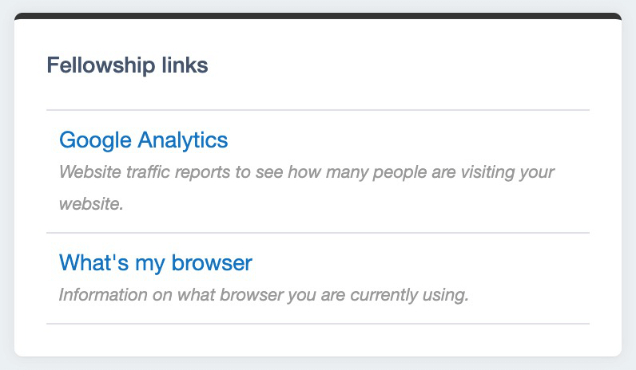

# Useful links panel

A useful links panel is included in the module but is disabled by default. This can be enabled through the yml config. We can also set the panel title and custom useful links through the config.

We set the config variables in our `app/_config/dashboard.yml` file:

```yml
Plastyk\Dashboard\Panels\UsefulLinksPanel:
  enabled: true
  title: 'Fellowship links'
  links:
    - Link: https://analytics.google.com/analytics/web/
      Title: Google Analytics
      Description: Website traffic reports to see how many people are visiting your website.
    - Link: https://whatsmybrowser.org/
      Title: What's my browser
      Description: Information on what browser you are currently using.
```

