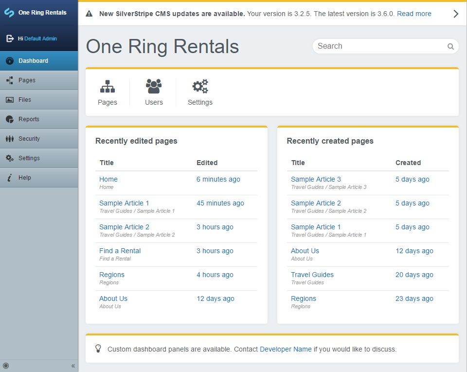

# SilverStripe Dashboard

This dashboard module provides a landing page for users logging into the CMS. Out of the box, allows viewing the state of recently created or modified pages, searching for pages & files as well as letting the user know whether the SilverStripe install is out of date.

## Requirements

See the "require" section of [composer.json](https://github.com/plastyk/silverstripe-dashboard/blob/master/composer.json)

## Installation (with composer)

    $ composer require plastyk/dashboard

## Configuration

By default the `UpdatePanel` and `MoreInformationPanel` tell the user to contact their web developer for help. We can make this display the developer name and email address to give a more personalised message. 

We can also adjust the panel accent colour to match the colour scheme of the website.

In our `mysite/_config/config.yml` add:

```yml
DashboardAdmin:
  contact_email: 'email@example.com'
  contact_name: 'Developer Name'
  panel_accent_color: '#efbc2a'
```


## Subsite compatibility

If using the [SilverStripe Subsites Module](https://github.com/silverstripe/silverstripe-subsites/) the dashboard menu item will not display on subsites by default. To fix this we can apply the `SubsiteMenuExtension` to our `DashboardAdmin`. In our `mysite/_config/config.yml` add:

```yml
DashboardAdmin:
  extensions:
    - SubsiteMenuExtension
```
