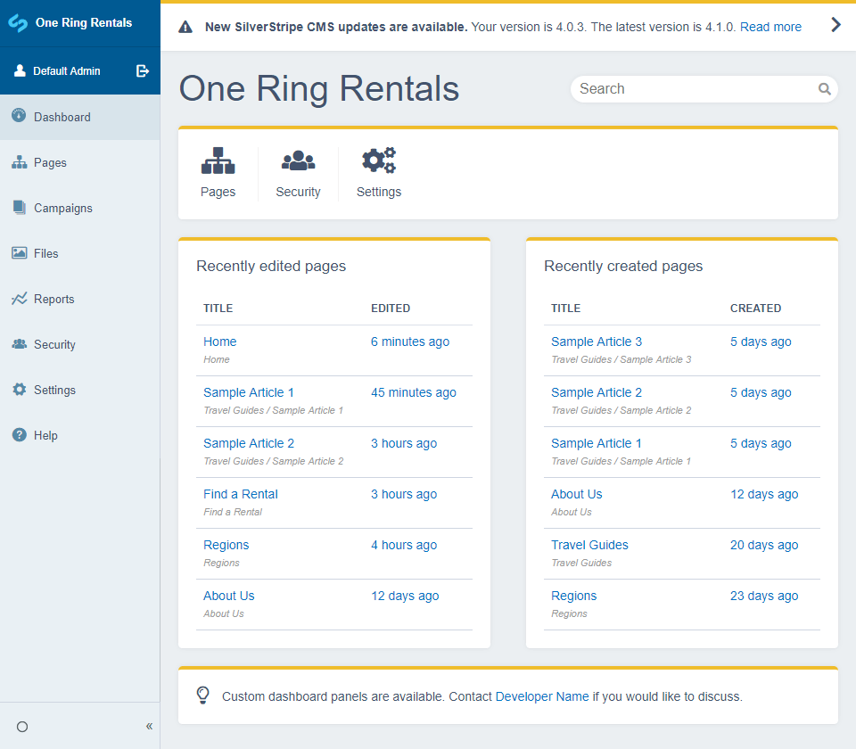

# Silverstripe Dashboard

This dashboard module provides a landing page for users logging into the CMS. Out of the box, allows viewing the state of recently created or modified pages, searching for pages & files as well as letting the user know whether the Silverstripe install is out of date.

## Requirements

See the "require" section of [composer.json](https://github.com/plastyk/silverstripe-dashboard/blob/master/composer.json)

## Installation (with composer)

    $ composer require plastyk/dashboard

## Configuration

By default the `UpdatePanel` and `MoreInformationPanel` tell the user to contact their web developer for help. We can make this display the developer name and email address to give a more personalised message.

We can also adjust the panel accent colour to match the colour scheme of the website.

In our `app/_config/dashboard.yml` add:

```yml
---
Name: app-dashboard
---
Plastyk\Dashboard\Admin\DashboardAdmin:
  contact_email: 'email@example.com'
  contact_name: 'Developer Name'
  panel_accent_color: '#efbc2a'
```


### Automatic search redirect

The dashboard search has functionality to automatically redirect the user straight to the result edit page if only one search result is found.

For example, if the user searches for "contact" and only one result is found across all search panels, the dashboard can automatically take the user to the contact edit page.

By default this functionality is turned off but can be enabled through a config variable per search class.

In our `app/_config/dashboard.yml` add the following to turn automatic redirection on for the `Page` class:

```yml
Page:
  dashboard_automatic_search_redirect: true
```

## Customisation
* [Adding new panels](https://plastyk.github.io/silverstripe-dashboard/en/customisation-new-panels)
* [Changing the main dashboard template](https://plastyk.github.io/silverstripe-dashboard/en/customisation-main-template)
* [Adding extra search panels](https://plastyk.github.io/silverstripe-dashboard/en/customisation-extra-search-panels)
* [Quick Links Panel Customisation](https://plastyk.github.io/silverstripe-dashboard/en/customisation-quicklinks)

## Subsite compatibility

If using the [Silverstripe Subsites Module](https://github.com/silverstripe/silverstripe-subsites/) the dashboard menu item will not display on subsites by default. To fix this we can apply the `SubsiteMenuExtension` to our `DashboardAdmin`. In our `app/_config/dashboard.yml` add:

```yml
Plastyk\Dashboard\Admin\DashboardAdmin:
  extensions:
    - SilverStripe\Subsites\Extensions\SubsiteMenuExtension
```
